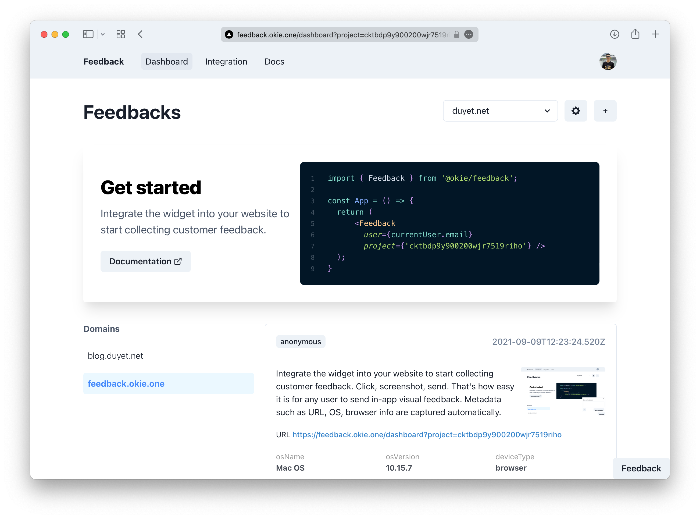

# Feedback

🤙Feedback is a platform built with Next.js, TypeScript & Prisma to collect issues, ideas, and compliments.

> Please take note that this project is still under heavy development.

Project information and milestone: [link](https://duyet.notion.site/feedback-okie-one-235f310b198946b184d3617cf3d50de6)



# Getting Started

## The Dashboard

Change the directory to `./dashboard` and install dependencies:

```bash
cd dashboard
yarn
```

Create the `.env` file from `.env.example`:

```bash
cp .env.example .env
vi .env
```

Run the following command to init the database.

```bash
yarn prisma migrate dev --name init
```

Now, seed the database with the sample data in prisma/seed.ts by running the following command:

```bash
yarn prisma db seed --preview-feature
```

Run the development server:

```bash
yarn dev
```

Open [http://localhost:3000](http://localhost:3000) with your browser to see the result.

> Note: The dashboard using Next proxy to route http://localhost:3000/docs to http://localhost:3001/docs
> Please start the dashboard and the docs at the same time.

## The Docs

Change the directory to `./docs` and install dependencies:

```bash
cd docs
yarn
```

```bash
yarn dev
```

Open [http://localhost:3001/docs](http://localhost:3001/docs) with your browser to see the result.

## The Widget

TBU
